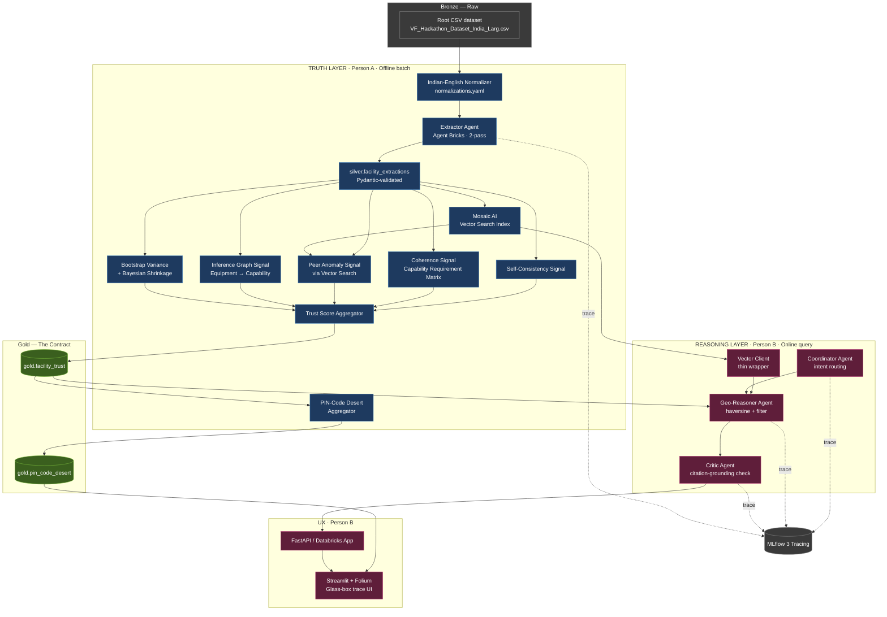

# MIT Hackathon C03 — Architecture & Two-Person Split
## "Truth Layer" × "Reasoning Layer" — Built to Integrate by Construction

> **Companion to:** `MIT_Hackathon_C03_Master_Plan.md`
> **Purpose:** The engineering architecture + a parallel-work split that integrates without merge hell.
> **Principle:** Contract-first development. Lock the schema in Hour 2. Both sides build against mocks. First real Gold handoff targets Hour 12-13 in the compressed Truth Layer sprint, with Hour 28 as the 48-hour fallback. Zero rework.

---

## 1. The Split — Why This One

| Split option | Verdict |
|---|---|
| Frontend vs Backend | ❌ Frontend dev idle for 20h |
| Data vs Agents | ❌ "Agents" person needs data to test against |
| **Truth Layer vs Reasoning Layer** | ✅ Each owns a coherent product slice; the seam is one schema |

**Person A — Truth Layer.** Owns everything offline: ingestion, Indian-English normalization, extraction, trust engine, inference graph, vector index, confidence intervals, and desert score. Output: Gold tables with cited, trust-scored capability claims.

**Person B — Reasoning Layer.** Owns everything online: agents, retrieval, API, frontend, map, MLflow tracing, demo. Consumes A's Gold tables as the only source of truth.

**The contract between them is `gold.facility_trust` and `gold.pin_code_desert`, represented by `src/shared/schemas.py`.** Lock those schemas in Hour 2. Everything else is implementation detail each person can change unilaterally.

---

## 2. System Architecture (full picture)



**Read this as:** Person A's pipelines all flow into the green contract tables. Person B reads only from green. Both write traces to MLflow. The arrows from Person B back into Person A's domain (`VIDX`) go through a thin client — they don't touch each other's code.

---

## 3. Person A — Truth Layer

### Mission
Take 10K messy facility records and produce two clean Gold tables that score every capability claim with calibrated trust + confidence intervals + citations.

### Owned components
1. **Bronze ingestion** — Excel → Delta Lake table in Unity Catalog
2. **Pydantic schemas** (shared, but A drafts them — see §5)
3. **Indian-English Normalization Layer** — `indian_medical_normalizations.yaml` → clean text before any LLM call
4. **Extractor pipeline** — Agent Bricks, structured output via function calling
5. **Two-pass extraction** — same record, different prompts, for self-consistency
6. **Capability Requirement Matrix** — config file mapping capabilities → required staff/equipment
7. **Equipment-to-Capability Inference Graph** — `capability_inference.yaml` → contradiction flags and `InferenceResult`
8. **Trust Engine** — four signal computations:
   - Self-consistency (intra-record variance across two passes)
   - Coherence (rule check against requirement matrix)
   - Peer anomaly (Vector Search → 10 nearest peers → outlier flag)
   - Inference graph (equipment/staff evidence independently supports or contradicts claims)
9. **Vector Search index** — embeddings over raw notes, exposed via Mosaic AI
10. **Bootstrap variance** — N=5 extractions on the top 1K high-stakes facilities for tighter intervals
11. **Bayesian shrinkage** — peer-prior posterior for capability claims
12. **Desert Score aggregator** — joins facility trust × population × geography, outputs PIN-level scores
13. **Batch pipelines** — 4 notebooks, runnable end-to-end with one command

### Hour-by-hour
| Hours | Deliverable |
|---|---|
| 0–2 | Root CSV dataset confirmed, joint schema lock with B, Bronze table path confirmed, CI/schema validation command green, 5 canonical mock facility records reviewed, Truth Layer skeleton files created, normalization and inference YAML drafts started |
| 2–4 | `normalizer.py` complete and tested on 20 samples; inference graph v1 runs on fixture evidence; mock fixtures expand to 50+ facility / 30+ PIN records; extractor v1 works on 100 records with normalization applied before LLM calls or a local Silver artifact if Databricks auth is blocked |
| 4–7 | Two-pass extraction across full 10K or largest feasible batch; self-consistency and coherence signals computed from `capability_requirements.yaml` |
| 7–9 | Inference Graph Signal 4 runs from `capability_inference.yaml`; `CapabilityClaim.inference_score` and `CapabilityClaim.inference_detail` populated; live-catch facility has `EQUIPMENT_CLAIM_MISMATCH` and `inference_score < 0.15` |
| 9–11 | Vector Search index built; peer anomaly signal computed for top 1–2K; all four signals aggregate into first `gold.facility_trust` |
| 11–12 | Bootstrap variance + Bayesian shrinkage on top 1K; confidence intervals populated |
| 12–13 | Desert Score → `gold.pin_code_desert`; first real data handoff to Person B; flip `HACKATHON_MODE=real` together |
| 13+ | Tighten demo facilities, respond to B feedback, rehearse Trust Engine + Inference Graph narration |

### Files A owns (no one else edits)
```
src/trust/**
notebooks/A_*.ipynb
src/shared/capability_requirements.yaml
src/shared/capability_inference.yaml
src/shared/indian_medical_normalizations.yaml
fixtures/mock_gold_*.json   (A is canonical; B can request additions)
```

---

## 4. Person B — Reasoning Layer

### Mission
Turn the Gold tables into a glass-box product: a query interface that routes through agents, returns cited answers with trust scores and confidence intervals, and renders a desert map. Plus the demo.

### Owned components
1. **Repo CI/CD scaffold** (early shared work, B drives it)
2. **Coordinator Agent** — parses query intent: search / audit / map / explain
3. **Geo-Reasoner Agent** — haversine distance filter + capability filter + trust threshold against `gold.facility_trust`
4. **Critic Agent** — given (query, candidate facilities, citations), confirms answer is supported; flags hallucination
5. **Vector Client** — thin wrapper around A's Vector Search index, exposes `query(text, k)` and `query_by_id(facility_id, k)`
6. **MLflow 3 tracing** — instruments every agent call, makes the trace pretty for demo
7. **API server** — FastAPI on Databricks Apps (or Streamlit-direct if simpler)
8. **Streamlit frontend** with three views:
   - Search: query bar → ranked facility cards with expandable trace
   - Map: India choropleth on `gold.pin_code_desert`, click PIN → drill in
   - Trust Breakdown: per-facility 4-signal visualisation, including inference contradictions when present
9. **Demo scenario library** — 3 one-click queries that always work
10. **Pitch deck** integration — exports map screenshot, trace screenshot for slides

### Hour-by-hour
| Hours | Deliverable |
|---|---|
| 0–2 | Repo skeleton with A, schemas locked, mock fixtures generated |
| 2–6 | Coordinator + Geo-Reasoner stubs running against mocks |
| 6–10 | Streamlit shell with query bar + result card components |
| 10–14 | MLflow tracing wired into every agent |
| 14–18 | Folium India map reading mock `gold.pin_code_desert` |
| 18–22 | Critic Agent + citation rendering in UI |
| 22–28 | Trust breakdown component (4-signal visual + confidence interval bars + inference contradiction display) |
| 12–13 target / 28–32 fallback | **First integration:** swap mocks for A's real Gold tables when A has a validated Gold cut |
| 32–40 | Demo scenarios scripted, pitch deck assembled |
| 40–48 | Rehearse with A, polish, record backup video |

### Files B owns (no one else edits)
```
src/reasoning/**
src/frontend/**
notebooks/B_*.ipynb
deck/**
demo/**
```

---

## 5. The Contract — Pydantic Schemas (LOCK at Hour 2)

This is the most important file in the repo. Both people sign off, both can propose changes via PR (5-min sync required).

```python
# src/shared/schemas.py
from datetime import datetime
from typing import List, Optional, Literal
from pydantic import BaseModel, Field

class Citation(BaseModel):
    """Exact provenance for any extracted fact."""
    source_field: str          # e.g. "free_text_notes"
    sentence: str              # exact substring from source
    char_start: int
    char_end: int

class InferenceResult(BaseModel):
    """
    Output of the Equipment-to-Capability Inference Graph for one capability.
    Tells us what the equipment inventory implies, independent of what the facility claims.
    """
    inferred_present: Optional[bool]   # None = insufficient equipment evidence
    inference_confidence: float = Field(..., ge=0, le=1)
    supporting_equipment: List[str]
    contradictions: List[str]
    inference_flags: List[str]

class CapabilityClaim(BaseModel):
    """One row per (facility, capability) — the atomic unit of trust."""
    capability: str                    # canonical taxonomy
    claim_present: bool                # facility says it has this
    self_consistency_score: float = Field(..., ge=0, le=1)
    coherence_score: float = Field(..., ge=0, le=1)
    peer_anomaly_score: float = Field(..., ge=0, le=1)
    inference_score: float = Field(..., ge=0, le=1)
    trust_score: float = Field(..., ge=0, le=1)
    confidence_interval_low: float
    confidence_interval_high: float
    citations: List[Citation]
    inference_detail: Optional[InferenceResult] = None
    flags: List[str] = []              # e.g. ["missing_anesthesiologist", "EQUIPMENT_CLAIM_MISMATCH"]

class FacilityTrustRecord(BaseModel):
    """One row per facility in gold.facility_trust."""
    facility_id: str
    facility_name: str
    pin_code: str
    state: str
    district: str
    lat: float
    lon: float
    facility_type: str                 # govt | private | charitable | unknown
    normalization_version: str
    capabilities: List[CapabilityClaim]
    overall_trust_score: float = Field(..., ge=0, le=1)
    extraction_run_ids: List[str]
    last_updated: datetime

class PinCodeDesert(BaseModel):
    """One row per (pin_code, capability) in gold.pin_code_desert."""
    pin_code: str
    state: str
    district: str
    lat: float
    lon: float
    population: Optional[int]
    capability: str
    nearest_verified_facility_id: Optional[str]
    distance_km: Optional[float]
    desert_score: float = Field(..., ge=0, le=1)   # higher = more deserted
```

**Rules:**
- Field added → OK if append-only, notify the other person in the next 5-min sync
- Field renamed → forbidden after Hour 2 (use deprecation alias)
- Field removed → forbidden after Hour 2 (keep nullable, mark deprecated)
- Field type changed → forbidden after Hour 2 (add a new field with the new type)
- New top-level model → either person can add unilaterally
- Schema tests in `tests/test_schemas.py` run on every CI build

**Hour 2 schema-change sync note:** The Truth Layer v2 schema adds `InferenceResult`, `CapabilityClaim.inference_score`, `CapabilityClaim.inference_detail`, and `FacilityTrustRecord.normalization_version` relative to the older draft. Person B should render `inference_detail.contradictions` when present and ignore `inference_detail` gracefully when null.

---

## 6. Repository Structure

```
hackathon-c03/
├── README.md                          # 1-pg run instructions
├── pyproject.toml
├── .github/workflows/ci.yml           # schema tests + lint, set up Hour 0
├── src/
│   ├── shared/                        # ⚠️ EDIT WITH CARE — both people
│   │   ├── schemas.py                 # 🔒 Pydantic contracts (LOCK Hour 2)
│   │   ├── catalog.py                 # Unity Catalog table names
│   │   ├── capability_requirements.yaml
│   │   ├── capability_inference.yaml
│   │   ├── indian_medical_normalizations.yaml
│   │   └── geocoding.py               # PIN → lat/lon helpers
│   ├── trust/                         # 👤 PERSON A
│   │   ├── extraction/
│   │   │   ├── extractor.py
│   │   │   ├── two_pass.py
│   │   │   ├── prompts.py
│   │   │   └── normalizer.py
│   │   ├── trust_engine/
│   │   │   ├── self_consistency.py
│   │   │   ├── coherence.py
│   │   │   ├── peer_anomaly.py
│   │   │   ├── inference_graph.py
│   │   │   └── aggregator.py
│   │   ├── confidence/
│   │   │   ├── bootstrap.py
│   │   │   └── bayesian.py
│   │   ├── desert/
│   │   │   └── pincode_aggregator.py
│   │   └── pipelines/
│   │       ├── 01_load_bronze.py
│   │       ├── 02_extract_silver.py
│   │       ├── 03_trust_gold.py
│   │       └── 04_desert_gold.py
│   ├── reasoning/                     # 👤 PERSON B
│   │   ├── agents/
│   │   │   ├── coordinator.py
│   │   │   ├── geo_reasoner.py
│   │   │   └── critic.py
│   │   ├── retrieval/
│   │   │   └── vector_client.py       # wraps A's Vector Search index
│   │   ├── api/
│   │   │   └── server.py
│   │   ├── tracing/
│   │   │   └── mlflow_setup.py
│   │   └── prompts/
│   └── frontend/                      # 👤 PERSON B
│       ├── app.py
│       ├── components/
│       │   ├── query_bar.py
│       │   ├── result_card.py
│       │   ├── trust_breakdown.py
│       │   └── trace_viewer.py
│       └── pages/
│           ├── 1_search.py
│           ├── 2_desert_map.py
│           └── 3_audit.py
├── notebooks/
│   ├── A_eda.ipynb
│   ├── A_extraction_dev.ipynb
│   ├── A_trust_dev.ipynb
│   ├── B_agent_dev.ipynb
│   └── B_demo_scenarios.ipynb
├── tests/
│   ├── test_schemas.py                # 🔒 contract tests (CI gate)
│   ├── trust/
│   └── reasoning/
├── fixtures/
│   ├── mock_gold_facility_trust.json  # 👤 A canonical, B consumes
│   └── mock_gold_pin_desert.json
├── deck/                              # 👤 B
│   └── pitch.pdf
└── demo/
    ├── scenarios.json                 # one-click queries
    └── backup_recording.mp4
```

**Ownership rule:** if a file is in your folder, you own it. If two people need to touch a shared file (`src/shared/`), it's a 5-minute sync, not a Slack thread.

---

## 7. Mock-First Development (the magic trick)

This is what makes the split actually parallel. Without it, B sits idle until the first real Gold handoff.

**Hour 2 unblock:** A generates 5 canonical `fixtures/mock_gold_facility_trust.json` records and a minimal PIN sample so Person B can build immediately. These records are hand-crafted, schema-valid, and reviewed with Person B before the schema lock message.

**Hour 4 expansion:** A expands `fixtures/mock_gold_facility_trust.json` to 50 records covering:
- A clean facility with high trust score (`overall_trust_score > 0.85`), citations, and inference-supported equipment
- A live-catch facility claiming `advanced_surgery` with `coherence_score=0.2`, `inference_score=0.05`, `trust_score < 0.4`, `flags=["missing_anesthesiologist", "EQUIPMENT_CLAIM_MISMATCH"]`, and `inference_detail.contradictions` populated
- An uncertainty showcase with a wide confidence interval such as `[0.45, 0.91]`
- 5 facilities clustered around Madhepura, Bihar (`lat ≈ 25.92`, `lon ≈ 86.79`) for the geo demo
- 10 government, 10 private, and 5 charitable facilities across Bihar, Jharkhand, Odisha, Maharashtra, and Karnataka
- At least 3 facilities per high-acuity capability

**Hour 4 expansion:** A also expands `fixtures/mock_gold_pin_desert.json` to 30 records covering:
- 5 deep deserts in rural Bihar/Jharkhand with `desert_score > 0.85`
- 5 well-served metro PINs with `desert_score < 0.2`
- Capability mix including `neonatal_icu`, `dialysis`, `emergency_obstetric_care`, and `advanced_surgery`

**Person B builds the entire frontend + agents against this mock.** Reads from `fixtures/` instead of Unity Catalog. When A's real Gold table is ready, swap the data source by changing one config line:

```python
# src/shared/catalog.py
USE_MOCK_GOLD = os.getenv("HACKATHON_MODE", "mock") == "mock"
GOLD_FACILITY_TRUST = (
    "fixtures/mock_gold_facility_trust.json"
    if USE_MOCK_GOLD
    else "main.gold.facility_trust"
)
```

That single line is the integration. Done.

---

## 8. Git Workflow (trunk-based, no merge hell)

- **`main`** — protected, CI must pass, both people merge here
- **`a/<feature>`** — Person A's branches (e.g. `a/coherence-signal`)
- **`b/<feature>`** — Person B's branches
- **PRs:** small, frequent — merge multiple times per day
- **Branches die in <8h.** No long-lived feature branches at hour 47.
- **CI gate:** schema tests + lint must pass before merge

```yaml
# .github/workflows/ci.yml — minimal, fast, ruthless
name: ci
on: [push, pull_request]
jobs:
  test:
    runs-on: ubuntu-latest
    steps:
      - uses: actions/checkout@v4
      - uses: actions/setup-python@v5
        with: { python-version: "3.11" }
      - run: pip install -e ".[dev]"
      - run: ruff check src/
      - run: mypy src/shared/                # strict on contracts only
      - run: pytest tests/test_schemas.py -v # contract tests must pass
      - run: pytest tests/                   # everyone else's tests
```

**The schema test is the single most important file in the repo:**

```python
# tests/test_schemas.py
import json
from src.shared.schemas import FacilityTrustRecord, PinCodeDesert

def test_mock_facility_trust_validates():
    """If this breaks, B's frontend breaks. Fix before merge."""
    with open("fixtures/mock_gold_facility_trust.json") as f:
        records = json.load(f)
    for r in records:
        FacilityTrustRecord(**r)  # raises if schema drift

def test_mock_pin_desert_validates():
    with open("fixtures/mock_gold_pin_desert.json") as f:
        records = json.load(f)
    for r in records:
        PinCodeDesert(**r)
```

Any schema drift fails CI immediately. You'll know within 90 seconds, not at hour 47.

---

## 9. The Sync Ritual

**Every 4 hours, 5 minutes, no exceptions:**

1. **Schema changes proposed?** (this is the only thing that *requires* sync)
2. **What's blocked on the other person?**
3. **Demo scenario alignment** — are we still pre-picking the same demo facility?

That's it. No status updates, no daily standups, no Notion docs. Just unblock and move.

**A 30-min joint integration session happens as soon as A has a validated Gold cut**: target Hour 12-13 in the compressed Person A sprint, with Hour 28 as the fallback in the broader 48-hour schedule.

---

## 10. Risks & Mitigations (be honest)

| Risk | Likelihood | Mitigation |
|---|---|---|
| Schema drift between mock and real | Med | CI test on both; A regenerates mock from real schema after each change |
| Normalization skipped on first extraction | Med | `02_extract_silver.py` acceptance test asserts `normalize_facility_text()` runs before extractor calls |
| Inference graph collapses into coherence logic | Med | Separate `coherence.py` and `inference_graph.py`; YAML configs remain separate sources of truth |
| Vector Search quotas / latency | Med | Cache aggressively; B uses `vector_client` thin wrapper so backend can swap to local FAISS if needed |
| A's pipeline runs slow on Free Edition | High | Process in batches of 1K; B can demo on top 1K if 10K not done by hour 36 |
| Streamlit doesn't deploy on Databricks Apps | Low | Fallback: run locally, screen-share for demo |
| One person gets stuck in a rabbit hole | High | 4-hour sync surfaces this; the other person reviews and unblocks |
| Demo facility's data turns out boring | Med | Pre-pick **3** demo facilities, keep the spicy one as backup |
| MLflow tracing slows everything down | Low | Sample at 10% in batch, 100% in demo |

---

## 11. The Integration Moment

This is the only place the two streams actually merge. Make it boring:

1. A pushes to `main`: real Gold tables in Unity Catalog, schema-validated
2. B pulls, flips `HACKATHON_MODE=real`
3. B runs the Streamlit app
4. **Expected outcome:** it just works, because both sides built against the same Pydantic contract
5. If it doesn't work: the schema test in CI will tell you exactly which field broke

If A and B did their jobs, this is a 15-minute event, not a 5-hour debugging session.

---

## 12. Why This Architecture Wins

- **Parallel from Hour 2.** Mock fixtures eliminate the blocker.
- **Contract-first.** Pydantic catches drift before it becomes a bug.
- **Medallion data flow.** Bronze → Silver → Gold is industry-standard, makes lineage obvious in the pitch.
- **Glass-box by design.** Every Gold row carries citations, confidence intervals, and inference detail; every agent call traces to MLflow. Transparency is not bolted on.
- **Evidence beats claims.** The Inference Graph asks whether equipment and staff logically support each high-acuity capability claim.
- **One seam, well-defended.** All cross-person interaction goes through 2 Gold tables. No spaghetti.
- **CI as a tripwire.** Schema test catches integration issues in 90 seconds.
- **Demo as architecture.** The Trust Engine isn't decorative — it's the load-bearing wall. Person A literally builds the pitch's money shot.

---

## 13. First 2 Hours — Joint Sprint

Both people on the same screen for 2 hours. Get this right and the rest is mechanical:

- [ ] Repo created, both have push access
- [ ] Dataset CSV present locally at `VF_Hackathon_Dataset_India_Large.xlsx - VF_Hackathon_Dataset_India_Larg.csv`
- [ ] `.gitignore` excludes raw `.csv` / `.xlsx` datasets
- [ ] `DATASET.md` documents local `FACILITY_CSV_PATH` and Databricks Volume override
- [ ] `pyproject.toml` with A/B dependencies declared explicitly: `pydantic>=2`, `pyspark`, `pandas`, `openpyxl`, `mlflow>=3`, `databricks-sdk`, `pyyaml`, `pytest`, `ruff`, `mypy`, plus B's UI dependencies if/when needed
- [ ] CI workflow committed and green on `main`
- [ ] `src/shared/schemas.py` written and signed off by both
- [ ] `src/shared/capability_requirements.yaml` first draft (10 entries is enough to start)
- [ ] `src/shared/capability_inference.yaml` first draft for the 5 P0 capabilities
- [ ] `src/shared/indian_medical_normalizations.yaml` first draft with 50+ entries
- [ ] `fixtures/mock_gold_facility_trust.json` with 5 canonical records for Hour 2 unblock
- [ ] `fixtures/mock_gold_facility_trust.json` expansion path to 50 records by Hour 4
- [ ] `fixtures/mock_gold_pin_desert.json` minimal Hour 2 sample and 30-record expansion path by Hour 4
- [ ] `tests/test_schemas.py` passing
- [ ] Both notebooks open, both can read mocks, both can write to `main` independently

After Hour 2, you don't need to sit together until the first integration handoff, except for 5-minute schema or blocker syncs.

---

## 14. Pre-Flight Checklist

Before you start coding (15 min review):

- [ ] Do you both agree the split is Truth × Reasoning, not Frontend × Backend?
- [ ] Do you both agree the Pydantic schema is the contract, not the database table or the API spec?
- [ ] Have you both read the Master Plan and aligned on the demo's "live catch" moment?
- [ ] Have you decided who is A and who is B based on actual strengths, not seniority?
- [ ] Is the Databricks Free Edition workspace shared and both have access?
- [ ] Do you both know what time the submission deadline is and when you'll stop coding?

If any answer is no — fix it now, not at hour 30.

---

*Now go build it. Lock the schema in Hour 2. Ship a working glass-box demo by Hour 40. Win the 65% Person A can directly influence.*
