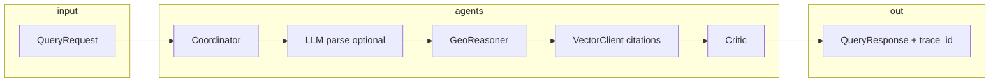

# Maarg

**Indian Healthcare Reasoning Auditor** · MIT Hackathon (Challenge 03)  
**Repository:** [github.com/Kshitij-KS/Maarg](https://github.com/Kshitij-KS/Maarg)

---

## The story in one minute

Imagine someone you care about needs **emergency obstetric care**, right now. The old answer is a list of hospitals sorted by distance. Distance is not the same as **capacity** or **truth**. Many facilities **claim** capabilities that the evidence does not fully support. Others are never seen by families who are **routed by panic and SEO**, not by proof.

**Maarg** is built for that gap. It does not replace ambulances or doctors. It replaces **guesswork with an auditable path**: we take structured truth from a **Gold truth layer** (facility trust, capability claims, citations), run a **multi-agent reasoning pipeline** that filters by geography and trust, pulls **evidence**, and asks a **Critic** whether the answer is grounded. Every run returns a **`trace_id`** so you can open the same reasoning in **MLflow** and show a judge: *this is not vibes, this is a pipeline.*

**मारग (Maarg)** means *the path*. This project is the path from **claim** to **evidence** to **confidence** to **action on a map**.

---

## The problem (what breaks today)

1. **Claims drift from reality.** Paper and PDF say one thing; the ward at 2 a.m. may say another.  
2. **Lists do not equal care.** Nearest is not the same as *able to treat*.  
3. **Planners see counts, not stress.** You need **where critical capability is missing**, not only where buildings exist.

Maarg attacks **(1)** with citations and trust scores, **(2)** with geo + capability reasoning, **(3)** with **medical desert** signals tied to the same Gold layer.

---

## Who this is for

- **Families and responders** who need a defensible shortlist under time pressure.  
- **NGOs and public health** teams who map access with **evidence**, not anecdotes.  
- **Planners** who fund infrastructure against **verified** gaps.

---

## What you can show in the demo (product surface)

| Surface | What judges see |
| --- | --- |
| **Search** | Natural-language query, ranked **candidates**, **trust**, **Critic verdict**, per-facility **citations**, **`trace_id`** for MLflow. |
| **Audit** | One facility page: capabilities, confidence bands, flags, proof sentences. |
| **Map** | Facilities + **desert** layers by capability (mock **Gold** in contest; **Databricks** in `real` mode). |
| **Portal** | Org login, **same** trust record the public layer uses, **evidence-backed** correction requests (queued, not silent DB edits). |
| **Emergency assist** | Location, ranked facilities, **dispatch-style briefing** + `tel:` (user places the call; no autodial). |

---

## Under the hood (technical depth)

### Reasoning pipeline (the spine of the product)

Each `POST /api/query` builds a [`QueryResponse`](backend/app/shared/schemas.py) through a single **ReasoningPipeline** ([`backend/app/reasoning/pipeline.py`](backend/app/reasoning/pipeline.py)):

1. **Coordinator:** intent from text, regex-style routing, applies user filters (distance, trust, capabilities, `top_k`).  
2. **LLMReasoningAgent (optional):** can **parse** and **explain** with **fallback** to deterministic behavior if the LLM path fails (see `_llm_parse_or_fallback` / `_llm_explain_or_fallback`).  
3. **GeoReasoner:** turns the routed pool into **geographically sensible candidates** with trust context.  
4. **VectorClient:** **citation retrieval** per candidate (stub; pluggable for your vector store).  
5. **Critic:** **grounds** the story: verdict + reasoning string on whether claims line up with evidence.  
6. **MLflow:** `@traced` spans; **trace attributes** (intent, candidate count, critic verdict); **`trace_id`** returned to the client for **timeline** deep links.



**Why this impresses juries:** you can name **agents**, show **a real trace**, and show **Pydantic contracts** on the wire, not a single opaque LLM call.

### Data and modes

- **`HACKATHON_MODE=mock`:** JSON under [`backend/fixtures/`](backend/fixtures/) (fast, reproducible, offline).  
- **`HACKATHON_MODE=real`:** read **Gold** from **Databricks Unity Catalog** (requires `DATABRICKS_HOST` + `DATABRICKS_TOKEN`).  
- **Schema** [`backend/app/shared/schemas.py`](backend/app/shared/schemas.py) is the **lock** between **Person A** (truth, extraction, Gold) and **Person B** (reasoning, API, this UI). **Append-only** is fine; breaking changes need an explicit team sync (see [CLAUDE.md](CLAUDE.md)).

### API surface (FastAPI)

Representative routes (all logged under MLflow at handler level where decorated):

- `POST /api/query`: main search.  
- `GET /api/facility/{id}/evidence`: audit page data.  
- `GET /api/desert/summary`: map and desert story.  
- `GET /api/trace/{id}/timeline`: tie **`trace_id`** to a **timeline** for the pitch.  
- `GET /api/demo-moments`: **demo cockpit** on the home page.  
- `POST /api/...` under **`/portal/*`:** registration, login, updates (facility-owned tables; **not** a direct write to Gold).

### Frontend stack

- **Next.js 15**, **TypeScript**, **TanStack React Query**, **Mapbox**, **Tailwind** + shadcn-style components.  
- Optional **Supabase** helpers for **future** auth and data; core demo runs against **FastAPI** + static fixtures.  
- From repo root, `npm run dev` can proxy to the **frontend** (see root [`package.json`](package.json)).

### Team split (how serious teams ship)

- **Person A:** extraction, **Gold** tables, **fixtures**, inference graph behind trust scores.  
- **Person B (this repo’s lane):** **reasoning**, **API**, **MLflow**, **Next.js** demo, **portal** API seam.

That split is a **VC and judge signal**: you are not a one-off script; you are a **system with contracts**.

---

## Why Maarg is not “another health chatbot”

| Chat or list app | Maarg |
| --- | --- |
| One-shot text | **Multi-agent** pipeline with explicit stages |
| “Trust us” | **Critic** + **citations** + **calibrated** scores |
| No provenance | **`trace_id` → MLflow** |
| Map as decoration | **Desert** + **trust** + **inference** on the same facts |

**Core loop we repeat in the pitch:** **claim → evidence → validation → confidence.**

---

## Quickstart (local, reproducible)

**Backend**

```bash
cd backend
python -m venv .venv
# Windows: .venv\Scripts\Activate.ps1
pip install -e ".[dev]"
cp .env.example .env
uvicorn app.api.server:app --reload --port 8000
```

**Frontend**

```bash
cd frontend
npm install
cp .env.example .env.local
# NEXT_PUBLIC_API_BASE_URL=http://localhost:8000
npm run dev
# http://localhost:3000
```

**Tests and smoke**

```bash
cd backend
pytest
python -m app.reasoning.demo
```

| Variable | Default | Role |
| --- | --- | --- |
| `HACKATHON_MODE` | `mock` | `mock` = fixtures, `real` = Databricks |
| `MLFLOW_TRACKING_URI` | `./mlruns` | Traces and experiments |
| `NEXT_PUBLIC_API_BASE_URL` | `http://localhost:8000` | Browser → API |

More env detail: [CLAUDE.md](CLAUDE.md), `backend/.env.example`, `frontend/.env.example`.

---

## Two-minute judge demo (scripted)

1. **Home:** demo cockpit, fire a **demo moment** that hits **`/api/query`** (or fallback copy if API is down).  
2. **Search:** show **candidates**, **trust**, **Critic** line, **copy `trace_id`**.  
3. **MLflow (killer 15 seconds):** open the trace; point at **stages and attributes**.  
4. **Audit:** open fixture **F00042** (dialysis story in materials); walk **citations** and **flags**.  
5. **Map:** one **desert** story (e.g. PIN **855107** in docs) + capability filter.  
6. (Optional) **Portal:** “we close the loop with facilities” + correction form.

**Do not break demo data:** keep **F00001**, **F00002**, **F00042**, PIN **855107** stable in fixtures unless Person A and B agree.

---

## Repository layout

```
backend/
  app/
    shared/         # Pydantic contract (lock with Person A)
    reasoning/      # Pipeline, agents, LLM fallbacks, MLflow
    api/              # FastAPI, Gold adapters, presenters
    portal/           # Registration and update requests
  fixtures/           # Mock Gold
frontend/             # Next.js app, maps, portal UI, emergency flow
package.json            # optional: npm run dev from repo root
```

---

## Submission portal: copy-paste (structured 1 to 6)

**1. Problem and challenge**  
Indian healthcare data is noisy: claims on paper do not always match the bed, the team, or the device in a crisis. The failure is not only “no hospital on the map” but “**the wrong** hospital for **this** emergency.” We target **unverified claims and blind routing** when every minute matters.

**2. Target audience**  
Families, responders, NGOs, and planners who need **defensible** lists and **maps** under uncertainty.

**3. Solution and core features**  
Maarg is a **reasoning auditor** on a Gold truth layer: **Coordinator → geo filtering → evidence → Critic**, returning **citations**, **confidence**, a **verdict string**, and a **`trace_id`**. The **map** encodes **medical deserts** on the same facts. A **portal** lets institutions **read their own record** and file **evidence-backed** changes through a **review path**. **Emergency assist** is a **user-driven** call flow (briefing + `tel:`, not autodial).

**4. USP**  
**Auditable, multi-stage reasoning** (not a single black-box completion), with **MLflow** traces and a **public schema contract** to Person A’s Gold. Built for **high-stakes** selection, not casual chat.

**5. Implementation**  
**FastAPI** + **Python** pipeline; **MLflow** tracing; **Pydantic** API contract; **Next.js** + **TypeScript** UI; **Mapbox**; **mock** fixtures and a **`real` Databricks** path. Optional **LLM** assist with **safe fallbacks** in the pipeline. Co-owned **schema** in `shared/`.

**6. Results and impact (demo scope)**  
We show **citation-backed** audit pages, **reproducible** traces, **desert** visualization, and a **credible** story for scaling to full Gold ingestion. Stated impact: **faster, better-informed** routing and a **reusable** national truth layer, not a one-off slide.

**GitHub (required):** `https://github.com/Kshitij-KS/Maarg`  
**Optional note:** team portal ID **HN-9761** if your event still uses it.  
**Live URL:** add when hosted; else say “repro from README.”

---

## Hackathon submission checklist

- [ ] **Demo video (~60s):** product story, home → search → audit or map, human pacing.  
- [ ] **Tech video (~60s):** this README’s **Under the hood** in spoken form: **agents**, **MLflow `trace_id`**, **schema**, **mock vs Databricks**.  
- [ ] **Play** both in the browser you submit from.  
- [ ] **Gallery:** UI + (MLflow or trace API response) stills.  
- [ ] **Team photo:** landscape, lit, not a Zoom screenshot.  
- [ ] **Event permissions** checkbox on the site.  

**Tags:** `FastAPI` `Next.js` `Python` `TypeScript` `MLflow` `healthcare` `reasoning` `audit` `maps` `Databricks-ready`

---

## License and event use

Confirm on the host platform that organizers may use your submission for documentation and **partner** review if that is required by the program.

---

*Maarg: from fragile lists to a **verifiable** path to care.*
