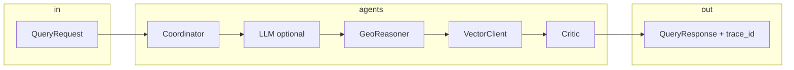

# Maarg: The Healthcare Truth Layer for Critical Care Discovery


| | |
| --- | --- |
| **Event** | MIT Hackathon (Challenge 03) · Indian Healthcare Reasoning Auditor |
| **Repository** | [github.com/Kshitij-KS/Maarg](https://github.com/Kshitij-KS/Maarg) |
| **Team ID** | `HN-9492` |
| **Deployment record** | April 26, 2026 |
| **Team** | **Ujjawal Anand** (contributor) · **Kshitij Singh** (contributor) |

---

## How to read this page

1. **Skim the identity and executive summary** for what we built.  
2. **Follow the story and problem** for why it matters.  
3. **Use “What to show in the demo” and the two-minute script** on demo day.  
4. **Use “Under the hood” and repository layout** for technical depth.  
5. **Copy portal fields 1–6** when pasting into the host submission form.  
6. **Run through the checklists** before the deadline.

**Yes — you can add pictures and screenshots.** GitHub renders them from this repo. See [Visual evidence (screenshots and diagrams)](#visual-evidence-screenshots-and-diagrams) for paths and examples.

---

## Table of contents

- [Project identity and executive summary](#project-identity-and-executive-summary)  
- [The story in one minute](#the-story-in-one-minute)  
- [The problem (what breaks today)](#the-problem-what-breaks-today)  
- [Who this is for](#who-this-is-for)  
- [What makes Maarg different (USP)](#what-makes-maarg-different-usp)  
- [What you can show in the demo (product surface)](#what-you-can-show-in-the-demo-product-surface)  
- [Visual evidence (screenshots and diagrams)](#visual-evidence-screenshots-and-diagrams)  
- [Under the hood (technical depth)](#under-the-hood-technical-depth)  
- [Why this is not “another health chatbot”](#why-this-is-not-another-health-chatbot)  
- [Quickstart (local)](#quickstart-local)  
- [Two-minute judge demo (scripted)](#two-minute-judge-demo-scripted)  
- [Repository layout](#repository-layout)  
- [Results, impact, and what is next (honest framing)](#results-impact-and-what-is-next-honest-framing)  
- [Submission portal: copy-paste (fields 1 to 6)](#submission-portal-copy-paste-fields-1-to-6)  
- [Hackathon submission checklist](#hackathon-submission-checklist)  
- [License and event use](#license-and-event-use)  

---

## Project identity and executive summary

**मारग (Maarg)** means *the path*. The product is the path from **claim → evidence → validation → confidence → action**.

Maarg is an **AI-powered healthcare reasoning system** that turns unreliable, unstructured facility data into **verified, evidence-backed intelligence**: not just *where* a hospital is, but **whether the record supports what it claims** about critical care. Search, audit, maps, and **MLflow-traced** reasoning form one story: **calibrated trust**, **citations**, **medical deserts**, and a **facility portal** that lets organizations submit **evidence-backed** corrections instead of silent edits to the truth layer.

---

## The story in one minute

Someone you care about needs **emergency obstetric care**, now. The old answer is a list sorted by distance. **Distance is not capacity, and a claim on a PDF is not proof on the ward.** Families and responders are forced into **guesswork**, **incomplete listings**, or **proximity** when they need **certainty**.

Maarg does not replace clinicians or ambulances. It gives you an **auditable path**: pull structured truth from a **Gold layer** (trust, capabilities, citations), run a **multi-agent pipeline** (coordinate intent, **geo**-filter, **evidence**, **Critic**), return **ranked candidates** with **per-claim confidence** and a **`trace_id`** you can open in **MLflow** and show a judge: **this is a pipeline, not a vibe.**

---

## The problem (what breaks today)

1. **Claims drift from reality.** Paper says one thing; the night ward may say another.  
2. **Lists are not care.** Nearest is not the same as *able to treat this case*.  
3. **Planners see counts, not stress.** You need **where critical capability is missing**, not only where buildings exist.

**Core insight:** the crisis in Indian facility data is not only **incompleteness**. It is **unverified claims**: a site can list advanced surgery without the team, or an ICU label without the equipment story in the notes. **Knowing a facility exists is not the same as knowing it can help.** Maarg is built around that distinction.

---

## Who this is for

- Patients and families under time pressure  
- Emergency coordinators and field responders  
- NGOs and public health teams  
- Policy and planning leads who allocate against **evidence**, not anecdotes  

---

## What makes Maarg different (USP)

| Typical tool | Maarg |
| --- | --- |
| “Nearest hospital” | **Nearest that the evidence supports** for the capability you asked for |
| Opaque “AI says” | **Coordinator → GeoReasoner → citations → Critic**, with **`trace_id` → MLflow** |
| Binary yes or no on a capability | **Calibrated confidence** on claims (trust score, intervals on signals in the contract) |
| Map as decoration | **Deserts + trust + inference** on the **same** Gold facts |

**Truth layer (Person A domain):** capability claims are tied to an **equipment-to-capability inference graph** in the extraction story: the system can **surface contradictions** between what a facility implies and what inventory and text support, and **penalize trust** when claims do not line up, with **traceable** source text. **Person B** ships the **reasoning API and UI** that **consume** that Gold and make it legible to users and judges.

**Facility portal:** corrections are not free text that silently rewrites Gold. Updates go through a **controlled queue**; where the product requires it, **photo proof** is captured with **browser geolocation** so submitters prove context at capture time (see `camera-capture` in the portal). **Approved** changes feed back through the pipeline Person A owns, so the network **improves with verified submissions**, not with unchecked typing.

**Emergency assist (this repo):** the **dispatch-style agent** ranks nearby facilities, builds a **verbal briefing** (including Hindi assist), and exposes **`tel:`** links to hospital lines plus **112**. The **user’s device** places the call. There is **no** server-side autodial, **no** live bed-availability API in this stack: the demo is **honest** about that boundary.

**Core loop for the pitch:** **claim → evidence → validation → confidence.**

---

## What you can show in the demo (product surface)

| Surface | What judges see |
| --- | --- |
| **Search** | Query, **candidates**, **trust**, **Critic** verdict, **citations per candidate**, **`trace_id`**. |
| **Audit** | One facility: capabilities, **flags**, **proof sentences**, confidence context. |
| **Map** | Facilities + **desert** view by capability (`mock` fixtures; **`real` → Databricks**). |
| **Portal** | Org view of **their** trust record, **update requests** with **proof** where required. |
| **Emergency assist** | Location, **ranked** facilities, **briefing** + `tel:` (user dials; **112** prominent). |

---

## Visual evidence (screenshots and diagrams)

**Pictures and screenshots are encouraged.** GitHub README supports standard Markdown images. Store assets in the repo so the submission stays self-contained after archive (avoid hotlinks that break later).

**Recommended location:** [docs/submission/screenshots/](docs/submission/screenshots/) — add PNG or JPG (WebP is fine on current GitHub). **Typical size:** 1280×720 or 1920×1080 for hero shots; keep files under a few MB each for fast load.

**Markdown pattern** (from repository root):

```markdown

```

**Suggested set for judges (rename as you add files):**

| File (example) | What it shows |
| --- | --- |
| `01-home.png` | Home / demo entry |
| `02-search.png` | Search with candidates + trace affordance |
| `03-audit.png` | Facility audit + citations / flags |
| `04-map.png` | Map + desert or facility layer |
| `05-mlflow.png` | MLflow trace for `trace_id` |
| `06-portal.png` | Portal queue or proof capture (if demoed) |

**Mermaid in README:** the pipeline diagram in [Under the hood](#under-the-hood-technical-depth) renders on GitHub without extra image files. You can add more Mermaid in this file for sequence or architecture if needed.

**Optional:** for the hackathon “gallery” field, the same image paths work; you can also attach hosted URLs in the portal if the host allows external links.

---

## Under the hood (technical depth)

### Reasoning pipeline

Each `POST /api/query` returns a [`QueryResponse`](backend/app/shared/schemas.py) from **ReasoningPipeline** ([`backend/app/reasoning/pipeline.py`](backend/app/reasoning/pipeline.py)):

1. **Coordinator:** intent, filters (distance, trust, capabilities, `top_k`).  
2. **LLMReasoningAgent (optional):** parse / explain with **fallback** to deterministic code if the LLM path errors.  
3. **GeoReasoner:** geographic candidate set with trust context.  
4. **VectorClient:** citation bundle per facility (stub; swappable for your vector store).  
5. **Critic:** grounded verdict and reasoning string.  
6. **MLflow:** `@traced` spans, attributes, **`trace_id`** for **timeline** APIs.



### Data, contract, and team split

- **`HACKATHON_MODE=mock`:** [`backend/fixtures/`](backend/fixtures/).  
- **`HACKATHON_MODE=real`:** Databricks **Unity Catalog** (credentials in env).  
- **[`backend/app/shared/schemas.py`](backend/app/shared/schemas.py):** **locked** contract between **Person A** (Gold, extraction, inference) and **Person B** (reasoning, API, frontend, portal). Append-only; breaking changes need explicit sync.  
- **Person B in this repo:** `reasoning/`, `api/`, `portal/`, MLflow, Next.js.

### API (FastAPI)

- `POST /api/query` · `GET /api/facility/{id}/evidence` · `GET /api/desert/summary` · `GET /api/trace/{id}/timeline` · `GET /api/demo-moments` · `POST` under `/portal/*` (registration, updates; **not** direct Gold writes)

### Frontend

**Next.js 15**, **TypeScript**, **TanStack Query**, **Mapbox**, **Tailwind** and shadcn-style UI. Optional **Supabase** wiring for future auth. Root `npm run dev` can target `frontend` via [root `package.json`](package.json).

---

## Why this is not “another health chatbot”

| Chat or list app | Maarg |
| --- | --- |
| One-shot text | **Multi-agent** pipeline with named stages |
| “Trust us” | **Critic** + **citations** + **calibrated** signals |
| No provenance | **`trace_id` → MLflow** |
| Map only | **Desert + trust + same facts** |

---

## Quickstart (local)

**Backend**

```bash
cd backend
python -m venv .venv
# Windows: .venv\Scripts\Activate.ps1
pip install -e ".[dev]"
cp .env.example .env
uvicorn app.api.server:app --reload --port 8000
```

**Frontend**

```bash
cd frontend
npm install
cp .env.example .env.local
npm run dev
# http://localhost:3000
```

**Tests / smoke**

```bash
cd backend
pytest
python -m app.reasoning.demo
```

| Variable | Default | Role |
| --- | --- | --- |
| `HACKATHON_MODE` | `mock` | `mock` = fixtures, `real` = Databricks |
| `MLFLOW_TRACKING_URI` | `./mlruns` | Experiments and traces |
| `NEXT_PUBLIC_API_BASE_URL` | `http://localhost:8000` | Browser to API |

More: [CLAUDE.md](CLAUDE.md), `backend/.env.example`, `frontend/.env.example`.

---

## Two-minute judge demo (scripted)

1. **Home:** demo cockpit → **`/api/query`** (or fallback moments if API is offline).  
2. **Search:** **candidates**, **trust**, **Critic**, **copy `trace_id`**.  
3. **MLflow:** open the trace, show **stages and attributes** (~15 s).  
4. **Audit:** e.g. **F00042**; walk **citations** and **flags**.  
5. **Map:** one **desert** narrative (e.g. PIN **855107** in materials).  
6. (Optional) **Portal** + (Optional) **emergency** briefing.

**Fixture IDs to preserve in mocks:** **F00001**, **F00002**, **F00042**, PIN **855107** (do not rename without team agreement).

---

## Repository layout

```
backend/
  app/
    shared/         # Pydantic contract (Person A + B)
    reasoning/        # Pipeline, agents, LLM fallbacks, MLflow
    api/              # FastAPI, adapters
    portal/           # Registration, updates, proof media
  fixtures/            # Mock Gold
frontend/              # Next.js: search, audit, map, portal, emergency UI
package.json            # optional: npm run dev from repo root
docs/
  submission/
    screenshots/        # optional README visuals (see above)
```

---

## Results, impact, and what is next (honest framing)

**In this submission we show:** structured outputs from messy inputs, **traceable** reasoning, **map-level** access gaps, and a **credible** path to **Databricks-scale** ingestion and reviewer-approved facility updates.

**Direction after the hackathon:** deeper **real-time** verification with live Gold, **tighter** integration with response workflows, and **deployment** for public health and policy where the contract and RLS allow.

The next step for AI in high-stakes settings is not only to **answer**, but to **show the work**. Maarg is a step in that direction.

---

## Submission portal: copy-paste (fields 1 to 6)

**1. Problem and challenge**  
In crises, people often struggle to **trust** facility data, not only to “find a pin.” Data is fragmented; claims can outrun ground truth. That yields delays, **mis-routing**, and avoidable harm. The core job is **verification of real capability**, not only discovery.

**2. Target audience**  
Patients and families; emergency coordinators; NGOs and public health; planners closing infrastructure gaps with evidence.

**3. Solution and core features**  
Multi-agent **reasoning** on Gold: **Coordinator → geo → evidence → Critic**; **citations**; **trace id**; **medical deserts** on the same layer; **portal** for **evidence-backed** updates; **emergency** UI with **briefing** and **`tel:`** (user places calls).

**4. USP**  
**Verifiable** pipeline (not a single black-box reply), **MLflow** observability, **Pydantic** contract to Gold, **calibrated** trust story, and **location-aware proof** in the portal where required.

**5. Implementation**  
**FastAPI**, **Python**, **MLflow**, **Next.js**, **TypeScript**, **Mapbox**, **React Query**; **mock** and **`real`** Databricks; optional **LLM** parse/explain with **code fallbacks**; co-owned **schemas** in `shared/`.

**6. Results and impact (demo scope)**  
We show **citation-backed** audit views, **reproducible** traces, **desert** visualization, and a defensible line to **national-scale** operation when live Gold and reviewers are connected.

**GitHub:** `https://github.com/Kshitij-KS/Maarg`  
**Team ID:** `HN-9492`  
**Live demo URL:** https://maarg-ruby.vercel.app/


**Tags:** `FastAPI` `Next.js` `Python` `TypeScript` `MLflow` `healthcare` `reasoning` `audit` `maps` `Databricks-ready`

---

## License and event use

Accept the host’s terms for use of your materials in **documentation** and **partner** review where the program requires it.

---

*Maarg: from fragile lists to a **verifiable** path to care.*
