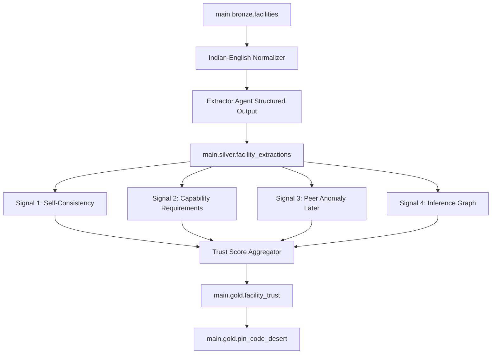

# Truth Layer Hour 0-8 Plan

I have read the master prompt for Person A: Truth Layer v2. Here is my Hour 0-8 plan, including the Normalization Layer and Inference Graph integration.

## Scope And Success Criteria

This plan covers Person A's Truth Layer only: shared contract setup, mock Gold fixture handoff, Indian-English normalization, extraction MVP through Silver, and Signal 4 inference graph v1. It does not touch Person B-owned files under [src/reasoning/](src/reasoning/), [src/frontend/](src/frontend/), [notebooks/B_*.ipynb](notebooks/B_*.ipynb), [deck/](deck/), or [demo/](demo/).

By Hour 8, Person B should be unblocked by a locked schema and validated mock fixtures, and Person A should have a working local/Databricks-ready Truth Layer path:

- `CapabilityClaim.inference_score` populated from the inference graph.
- `CapabilityClaim.inference_detail` populated with `InferenceResult` where supported.
- `FacilityTrustRecord.normalization_version` populated from the normalizer.
- Citations preserved for every extracted/fixture capability claim.
- One demo "live catch" facility with `EQUIPMENT_CLAIM_MISMATCH`, `inference_score < 0.15`, and `trust_score < 0.4`.
- The live-catch aggregate is protected by test, not just fixture values. If `EQUIPMENT_CLAIM_MISMATCH` fires, cap or assert the final claim trust stays demo-safe at `trust_score <= 0.35`.
- Normalization applied before any extractor call in [src/trust/pipelines/02_extract_silver.py](src/trust/pipelines/02_extract_silver.py).

## Contract And Sync Rules

No schema-breaking changes are planned. The schema will be created exactly from the master prompt in [src/shared/schemas.py](src/shared/schemas.py), including the contract models and additive fields that must be flagged before Hour 2 lock:

- `Citation`
- `InferenceResult`
- `CapabilityClaim.inference_score`
- `CapabilityClaim.inference_detail`
- `FacilityTrustRecord.normalization_version`

Hour 1:45 hard gate with Person B:

- Review the exact Pydantic definitions in [src/shared/schemas.py](src/shared/schemas.py).
- Review JSON examples for the first 5 canonical demo records.
- Confirm nullability/defaults for `CapabilityClaim.inference_detail` and fixture serialization for `last_updated`.
- Only after that review, send the Hour 2 schema lock message.

Hour 2 sync message to Person B:

`schema locked, Person B unblocked. Contract includes Citation, InferenceResult, CapabilityClaim.inference_score, CapabilityClaim.inference_detail, and FacilityTrustRecord.normalization_version. Frontend should render inference_detail.contradictions when present and ignore inference_detail when null.`

If implementation reveals a need to rename, remove, or type-change any field in [src/shared/schemas.py](src/shared/schemas.py), stop immediately and surface `SCHEMA CHANGE PROPOSED:` with downstream impact before editing.

## High-Level Data Flow

Signal 3 is acknowledged but not the Hour 0-8 critical path except for interfaces and neutral/default handling where needed. Full Vector Search peer anomaly lands after Hour 8.

## Hour 0-2: Contract, Skeleton, Fixtures, And Databricks Grounding

1. Confirm dataset input and repo shape, then create the owned Truth Layer skeleton only where missing.

   Dataset decision:
   - Use the root CSV as the operational local input: [VF_Hackathon_Dataset_India_Large.xlsx - VF_Hackathon_Dataset_India_Larg.csv](VF_Hackathon_Dataset_India_Large.xlsx%20-%20VF_Hackathon_Dataset_India_Larg.csv).
   - Keep Excel only as source provenance if it is provided later; do not make the pipeline depend on Excel parsing.
   - Add `.gitignore` coverage for raw `.csv` / `.xlsx` data files.
   - Document the local and Databricks conventions in [DATASET.md](DATASET.md).

   Files:
   - [pyproject.toml](pyproject.toml)
   - [src/shared/schemas.py](src/shared/schemas.py)
   - [src/shared/catalog.py](src/shared/catalog.py)
   - [src/shared/capability_requirements.yaml](src/shared/capability_requirements.yaml)
   - [src/shared/capability_inference.yaml](src/shared/capability_inference.yaml)
   - [src/shared/indian_medical_normalizations.yaml](src/shared/indian_medical_normalizations.yaml)
   - [src/trust/](src/trust/)
   - [src/trust/extraction/normalizer.py](src/trust/extraction/normalizer.py) as a skeleton/stub file, implemented in Hour 2-4
   - [src/trust/trust_engine/inference_graph.py](src/trust/trust_engine/inference_graph.py) as a skeleton/stub file, implemented first against fixtures before Hour 6
   - [tests/test_schemas.py](tests/test_schemas.py)
   - [fixtures/mock_gold_facility_trust.json](fixtures/mock_gold_facility_trust.json)
   - [fixtures/mock_gold_pin_desert.json](fixtures/mock_gold_pin_desert.json)

2. Add dependencies explicitly in [pyproject.toml](pyproject.toml), with no silent installs:

   `pydantic>=2`, `pyspark`, `pandas`, `openpyxl`, `mlflow>=3`, `databricks-sdk`, `pyyaml`, `pytest`, `ruff`, `mypy`.

3. Lock [src/shared/schemas.py](src/shared/schemas.py) exactly to the master prompt contract.

   Contract fields most important to Person B:
   - `FacilityTrustRecord.capabilities`
   - `CapabilityClaim.trust_score`
   - `CapabilityClaim.confidence_interval_low`
   - `CapabilityClaim.confidence_interval_high`
   - `CapabilityClaim.citations`
   - `CapabilityClaim.inference_score`
   - `CapabilityClaim.inference_detail`
   - `FacilityTrustRecord.normalization_version`
   - `PinCodeDesert.desert_score`

4. Add [src/shared/catalog.py](src/shared/catalog.py) as the single place for table names and runtime flags.

   Decisions:
   - `FACILITY_CSV_PATH` points to the local root CSV by default.
   - Default tables are `main.bronze.facilities`, `main.silver.facility_extractions`, `main.gold.facility_trust`, and `main.gold.pin_code_desert`.
   - Include `USE_MOCK_GOLD` and environment-driven catalog/schema override hooks so Databricks Free Edition naming can be adjusted without hardcoded paths elsewhere.
   - Databricks should override `FACILITY_CSV_PATH` to a Unity Catalog Volume path such as `/Volumes/main/bronze/raw/facilities_raw.csv`.

5. Draft YAML sources of truth.

   Files:
   - [src/shared/indian_medical_normalizations.yaml](src/shared/indian_medical_normalizations.yaml): at least the full map from the prompt, targeting 50+ entries immediately.
   - [src/shared/capability_inference.yaml](src/shared/capability_inference.yaml): first five P0 capabilities from the prompt, with contradiction caps and flags: `advanced_surgery`, `emergency_obstetric_care`, `neonatal_icu`, `dialysis`, and `emergency_trauma`.
   - [src/shared/capability_requirements.yaml](src/shared/capability_requirements.yaml): the same first five P0 capabilities for coherence, kept separate from inference logic.
   - Keep the capability taxonomy capped at 10-15 high-acuity capabilities for the hackathon; do not expand breadth until the demo-critical capabilities are reliable.

6. Produce Person B's mock Gold contract.

   The prompt contains both an early "5 hand-crafted records" instruction and a later hard requirement of 50 facility records and 30 PIN records. Split this into unblock and expansion so Person B is not delayed:
   - Hour 2 unblock: 5 canonical, hand-crafted facility records plus a minimal PIN sample, schema-valid and reviewed with Person B.
   - Hour 4 expansion target: [fixtures/mock_gold_facility_trust.json](fixtures/mock_gold_facility_trust.json) reaches 50 records minimum, seeded by those 5 canonical demo records.
   - Hour 4 expansion target: [fixtures/mock_gold_pin_desert.json](fixtures/mock_gold_pin_desert.json) reaches 30 records minimum.
   - If time permits, generate the 50/30 expansion before Hour 2. If it threatens schema lock or Person B unblock, ship the 5 canonical records first and expand immediately after.

   Required fixture cases:
   - Clean win: `overall_trust_score > 0.85`, all four signals aligned, citations present, inference supported.
   - Live catch: claims `advanced_surgery`, `coherence_score=0.2`, `inference_score=0.05`, flags include `missing_anesthesiologist` and `EQUIPMENT_CLAIM_MISMATCH`, and `inference_detail.contradictions` contains the exact advanced-surgery contradiction.
   - Uncertainty showcase: wide interval such as `confidence_interval_low=0.45`, `confidence_interval_high=0.91`.
   - Five Madhepura-area facilities around lat `25.92`, lon `86.79`.
   - State/type variety across Bihar, Jharkhand, Odisha, Maharashtra, and Karnataka.
   - At least three facilities per high-acuity capability.
   - PIN deserts include Bihar/Jharkhand high-desert rows, metro low-desert rows, and capabilities `neonatal_icu`, `dialysis`, `emergency_obstetric_care`, and `advanced_surgery`.

7. Add schema validation tests.

   Files:
   - [tests/test_schemas.py](tests/test_schemas.py)
   - Optionally [tests/trust/test_mock_gold_contract.py](tests/trust/test_mock_gold_contract.py) if the repo test layout favors domain-specific tests.

   Test scenarios:
   - Every facility fixture validates with `FacilityTrustRecord`.
   - Every PIN fixture validates with `PinCodeDesert`.
   - The live-catch fixture contains `CapabilityClaim.inference_score < 0.15` and `CapabilityClaim.inference_detail.contradictions`.
   - The live-catch aggregate computes `CapabilityClaim.trust_score < 0.4`; preferred hard cap is `EQUIPMENT_CLAIM_MISMATCH => trust_score <= 0.35`.
   - The clean-win fixture has `overall_trust_score > 0.85`, all four signal fields high, and at least one populated citation.
   - The uncertainty fixture has a visibly wide confidence interval.
   - Fixture counts enforce at least 5 canonical facility records by Hour 2, then at least 50 facility records and 30 PIN desert records by the Hour 4 expansion gate.
   - Demo regression tests cover the clean win, live catch, uncertainty showcase, and Madhepura-area query cluster.
   - Every `CapabilityClaim.citations` list is non-empty.
   - CI rejects missing `normalization_version`.
   - JSON serialization is stable: deterministic facility IDs, canonical capability strings, ISO datetime strings for `last_updated`, fixed live-catch ID, and a snapshot/hash check for the first 5 canonical demo records.

8. Add minimal CI.

   File:
   - [.github/workflows/ci.yml](.github/workflows/ci.yml)

   CI should run schema tests and ruff. Mypy strictness is scoped to [src/shared/](src/shared/) once the package skeleton exists.

9. Databricks grounding for later execution.

   Planning constraints from the Databricks skill:
   - Do not invent Databricks CLI or MLflow APIs.
   - Before live Databricks operations, verify CLI availability and auth profiles.
   - Never auto-select a Databricks profile; list profiles and ask Person A to choose.
   - Use positional Unity Catalog CLI forms where applicable.
   - Verify MLflow 3 tracing decorator/API names against current Databricks docs before implementation.

## Hour 2-4: Normalization Layer And Extraction MVP

1. Implement the normalizer as a pure, testable preprocessing unit.

   Files:
   - [src/trust/extraction/normalizer.py](src/trust/extraction/normalizer.py)
   - [tests/trust/extraction/test_normalizer.py](tests/trust/extraction/test_normalizer.py)

   Requirements:
   - Read [src/shared/indian_medical_normalizations.yaml](src/shared/indian_medical_normalizations.yaml).
   - Return `(normalized_text, normalization_version)`.
   - Apply abbreviation, availability, equipment-count, regional-term, ownership, and staff normalizations before extractor use.
   - Prioritize demo-critical terms for high-acuity claims: `LSCS`, `OT`, `Obs & Gynae`, `ICU/ICCU`, `O2 cyl`, `vent`, `def`, `24x7`, `sarkari`, `pvt`, and `visiting consultant`.
   - Define deterministic conflict ordering: equipment count normalization runs before generic abbreviations where a term can match both; longer keys are applied before shorter keys within each group.
   - Keep it out of the LLM prompt so normalization is cheap, deterministic, and testable.

   Test scenarios:
   - `LSCS` expands to `Lower Segment Caesarean Section (Caesarean Surgery)`.
   - `O2 cyl 2 nos` becomes `2 Oxygen Cylinders`.
   - `24x7` becomes `24/7 Availability`.
   - `sarkari` becomes `Government`.
   - Mixed-case abbreviations normalize case-insensitively.
   - Unknown text remains unchanged except for configured matches.
   - Version returned matches YAML `version`.
   - Demo-critical raw text becomes clearer for inference inputs, e.g. `LSCS with OT 24x7, O2 cyl 2 nos` preserves C-section, operation theatre, availability, and oxygen evidence in canonical language.

2. Implement inference graph v1 early against fixture/sample extracted evidence.

   Files:
   - [src/trust/trust_engine/inference_graph.py](src/trust/trust_engine/inference_graph.py)
   - [src/shared/capability_inference.yaml](src/shared/capability_inference.yaml)
   - [tests/trust/trust_engine/test_inference_graph.py](tests/trust/trust_engine/test_inference_graph.py)

   Requirements:
   - Read inference rules from YAML.
   - Implement the first five P0 capabilities immediately: `advanced_surgery`, `emergency_obstetric_care`, `neonatal_icu`, `dialysis`, and `emergency_trauma`.
   - Encode required equipment/staff evidence, supporting equipment, contradiction flags, and score caps in YAML, not Python conditionals.
   - Return `InferenceResult` for each capability.
   - Claimed high-acuity capabilities with missing required evidence trigger configured contradiction flags.
   - Run first on fixture/sample extracted equipment and staff; do not wait for live LLM extraction.

3. Create or adapt extractor interfaces without hardcoding unknown Agent Bricks APIs.

   Files:
   - [src/trust/extraction/extractor.py](src/trust/extraction/extractor.py)
   - [src/trust/extraction/prompts.py](src/trust/extraction/prompts.py)
   - [tests/trust/extraction/test_extractor_contract.py](tests/trust/extraction/test_extractor_contract.py)

   Approach:
   - Define a narrow extractor boundary that accepts a `NormalizedFacilityText` object containing `text` and `normalization_version`, not a raw string.
   - Keep any Agent Bricks implementation behind an adapter so mock/local tests do not require Databricks connectivity.
   - Version extraction prompts and expose prompt version/hash metadata for later structured logs.
   - Defer exact Agent Bricks and MLflow tracing call signatures until docs verification during implementation.
   - Databricks quarantine rule: until docs, CLI auth, and profile are verified, all Agent Bricks, MLflow, Unity Catalog, and Databricks SDK calls stay behind adapters with local fakes. No notebook cell should call unverified SDK/MLflow APIs.
   - Add a small `verified_api_notes.md` or README section before replacing any local fake with a real Databricks call.

4. Wire Bronze-to-Silver orchestration with normalization first.

   Files:
   - [src/trust/pipelines/02_extract_silver.py](src/trust/pipelines/02_extract_silver.py)
   - [notebooks/A_eda.ipynb](notebooks/A_eda.ipynb)
   - [notebooks/A_02_extract_silver.ipynb](notebooks/A_02_extract_silver.ipynb), if notebooks are separated by pipeline.

   Requirements:
   - `normalize_facility_text(raw_text_blob)` runs before any extractor call.
   - Silver records preserve `normalization_version` for downstream Gold.
   - Extraction output must be Pydantic-valid before Silver write.
   - Every extracted capability has at least one `Citation` or is dropped/flagged according to the "cite everything" rule.
   - Missing or empty `raw_text_blob` produces no capability claims plus an explicit extraction flag; it must not fabricate a capability.
   - Invalid structured output is rejected before Silver and logged with `facility_id`.
   - Extractor timeout or Databricks write failure is logged with `run_id` and `facility_id`, then skipped from Gold assembly for that run.
   - Tests monkeypatch the extractor boundary and fail if [src/trust/pipelines/02_extract_silver.py](src/trust/pipelines/02_extract_silver.py), [src/trust/extraction/two_pass.py](src/trust/extraction/two_pass.py), or notebooks pass raw strings instead of `NormalizedFacilityText`.

5. Hour 4 acceptance check.

   Outcomes:
   - Normalizer tests pass.
   - Inference graph v1 tests pass on fixture/sample evidence for the five P0 capabilities.
   - The 50 facility / 30 PIN fixture expansion is complete unless Person A explicitly accepts a narrower temporary handoff.
   - 20 sample records can be normalized with visible clarity improvements.
   - Extractor MVP can process 100 records using normalized text via mock/local adapter or verified Databricks adapter.
   - If Databricks auth/profile selection is available, the 100-record normalized run populates `main.silver.facility_extractions`.
   - If Databricks access is blocked, produce a Pydantic-valid local Silver artifact with the same schema shape and surface the blocker immediately rather than pretending Silver is populated.

## Hour 4-6: Two-Pass Extraction, Self-Consistency, And Coherence

1. Add deterministic two-pass extraction scaffolding.

   Files:
   - [src/trust/extraction/two_pass.py](src/trust/extraction/two_pass.py)
   - [tests/trust/extraction/test_two_pass.py](tests/trust/extraction/test_two_pass.py)

   Approach:
   - Define fixture/sample records with `pass_1` and `pass_2` structured outputs.
   - Compute scoring pipeline behavior from those structured outputs first.
   - Live LLM two-pass orchestration remains optional after the scoring pipeline works.
   - Intended live path: Pass 1 extracts candidate capabilities, equipment, staff, and citations; Pass 2 critiques or reconciles candidate outputs using structured output.
   - Keep prompt variants in [src/trust/extraction/prompts.py](src/trust/extraction/prompts.py) with explicit versions.

2. Implement Signal 1 self-consistency.

   Files:
   - [src/trust/trust_engine/self_consistency.py](src/trust/trust_engine/self_consistency.py)
   - [tests/trust/trust_engine/test_self_consistency.py](tests/trust/trust_engine/test_self_consistency.py)

   Requirements:
   - Compare pass outputs per `(facility_id, capability)`.
   - Produce `CapabilityClaim.self_consistency_score` in `[0, 1]`.
   - Preserve uncertainty when passes disagree.
   - Treat deterministic mock passes as scaffolding, not evidence of real LLM reliability.

3. Implement Signal 2 coherence from requirements YAML.

   Files:
   - [src/trust/trust_engine/coherence.py](src/trust/trust_engine/coherence.py)
   - [src/shared/capability_requirements.yaml](src/shared/capability_requirements.yaml)
   - [tests/trust/trust_engine/test_coherence.py](tests/trust/trust_engine/test_coherence.py)

   Requirements:
   - Keep capability requirement logic in YAML, not scattered Python conditionals.
   - Populate `CapabilityClaim.coherence_score`.
   - Add flags like `missing_anesthesiologist` when required staff/equipment is absent.
   - Keep coherence distinct from `CapabilityClaim.inference_score`.
   - Coherence invariant: evaluate whether claimed capabilities satisfy the declared capability-requirement matrix.
   - Inference invariant: infer support or contradiction from extracted evidence relationships independent of the facility claim.
   - Namespace or document flags so coherence failures and inference contradictions do not look like duplicate evidence paths.
   - Tests include one case where coherence is low but inference is neutral, and one where inference contradicts while coherence remains independently explainable.

4. Hour 6 acceptance check.

   Outcomes:
   - 100-record Silver run validates end to end.
   - Self-consistency and coherence scores are computed for core capabilities.
   - Demo live-catch fixture remains valid and mirrors the intended scoring pattern.

## Hour 6-8: Inference Graph V1 And Gold Assembly Path

1. Harden Signal 4 inference graph integration.

   Files:
   - [src/trust/trust_engine/inference_graph.py](src/trust/trust_engine/inference_graph.py)
   - [src/shared/capability_inference.yaml](src/shared/capability_inference.yaml)
   - [tests/trust/trust_engine/test_inference_graph.py](tests/trust/trust_engine/test_inference_graph.py)

   Requirements:
   - Reuse the Hour 2-4 inference graph implementation instead of rebuilding it.
   - Populate `InferenceResult.inferred_present`, `InferenceResult.inference_confidence`, `InferenceResult.supporting_equipment`, `InferenceResult.contradictions`, and `InferenceResult.inference_flags` in Gold assembly.
   - Unknown capabilities return neutral confidence and `CAPABILITY_NOT_IN_INFERENCE_GRAPH`.
   - Claimed high-acuity capabilities with missing required evidence trigger configured contradiction flags.

   Test scenarios:
   - Advanced surgery with anesthesia machine and anesthesiologist infers present with high confidence.
   - Advanced surgery claim without anesthesia machine or anesthesiologist returns `inferred_present=False`, `inference_confidence <= 0.15`, and `EQUIPMENT_CLAIM_MISMATCH`.
   - Dialysis claim without dialysis equipment returns configured contradiction and low score cap.
   - ICU evidence with ventilator/supporting equipment boosts confidence.
   - Unknown capability returns neutral confidence and no contradiction.

2. Implement first Trust Score Aggregator path.

   Files:
   - [src/trust/trust_engine/aggregator.py](src/trust/trust_engine/aggregator.py)
   - [tests/trust/trust_engine/test_aggregator.py](tests/trust/trust_engine/test_aggregator.py)

   Requirements:
   - Use weights from the prompt: self-consistency `0.25`, coherence `0.30`, peer anomaly `0.20`, inference `0.25`.
   - Until Signal 3 is available, use a documented neutral value of `peer_anomaly_score=0.5` and add a `PEER_ANOMALY_NOT_COMPUTED` flag.
   - For demo-critical claims, test the weighted aggregate with that neutral value so the live catch still satisfies `trust_score < 0.4`.
   - If `EQUIPMENT_CLAIM_MISMATCH` is present, cap final `trust_score` at `0.35` unless Person A explicitly rejects the cap.
   - Populate `CapabilityClaim.trust_score` and facility-level `FacilityTrustRecord.overall_trust_score`.
   - Merge inference flags and coherence flags into `CapabilityClaim.flags` without losing configured contradiction details.

3. Create Gold assembly path for facility trust.

   Files:
   - [src/trust/pipelines/03_trust_gold.py](src/trust/pipelines/03_trust_gold.py)
   - [tests/trust/pipelines/test_trust_gold_contract.py](tests/trust/pipelines/test_trust_gold_contract.py)

   Requirements:
   - Convert Silver extraction rows plus signal outputs into `FacilityTrustRecord` objects.
   - Preserve `normalization_version` from the extraction step.
   - Preserve `extraction_run_ids` and `last_updated`.
   - Produce append-only Gold partitions by extraction run in real Databricks execution design.
   - Emit data in the same schema as [fixtures/mock_gold_facility_trust.json](fixtures/mock_gold_facility_trust.json).

4. Hour 8 acceptance check.

   Outcomes:
   - Inference graph tests pass locally.
   - Aggregator tests prove all four signals contribute to `CapabilityClaim.trust_score`.
   - Live-catch facility produces `EQUIPMENT_CLAIM_MISMATCH`, `CapabilityClaim.inference_score < 0.15`, and aggregate `CapabilityClaim.trust_score < 0.4`.
   - Gold assembly can produce Pydantic-valid `FacilityTrustRecord` objects from fixture/sample extraction data.
   - Person B remains able to develop exclusively from validated mock Gold fixtures.

## Cross-Cutting Implementation Rules

- All new public functions get type hints.
- All feature-bearing code gets unit tests alongside implementation.
- No hardcoded credentials, workspace URLs, or file paths outside [src/shared/catalog.py](src/shared/catalog.py).
- Structured logging is designed around `{run_id, facility_id, capability, prompt_hash, latency_ms, token_usage}`.
- MLflow tracing is planned for extraction and trust-engine passes, but exact `@mlflow.trace` usage must be verified against current Databricks MLflow 3 docs before coding.
- Databricks CLI profile use must be explicit and approved by Person A.
- Until Databricks APIs are verified, implementation uses local fakes/adapters only; real SDK, Agent Bricks, Unity Catalog, and MLflow calls require a documented verification note first.
- Gold writes are append-only by `extraction_run_id`; latest views can be introduced after the first end-to-end run.
- No Streamlit, FastAPI, Folium, or Person B UI code in the Truth Layer.
- No confidence-washing: if only one extraction pass exists for a record, use a wide interval such as `[0, 1]` unless a documented bootstrap/shrinkage path justifies something narrower.
- Hour 0-8 provisional interval rule: when bootstrap and Bayesian shrinkage are not available, set `confidence_interval_low=max(0, trust_score - 0.20)` and `confidence_interval_high=min(1, trust_score + 0.20)`, then add `PROVISIONAL_INTERVAL` to `CapabilityClaim.flags`. For single-pass extraction only, prefer `[0, 1]`.
- Person B path guard: before any merge, inspect changed paths and stop if the diff includes `src/reasoning/**`, `src/frontend/**`, `notebooks/B_*.ipynb`, `deck/**`, or `demo/**`.
- CI ownership exception: [.github/workflows/ci.yml](.github/workflows/ci.yml) is shared only for the schema-validation gate; coordinate with Person B if CI edits go beyond `ruff`, `mypy src/shared/`, and `pytest tests/test_schemas.py`.

## Verification Plan

Before moving past Hour 2:
- Schema fixture validation passes.
- Ruff passes for created files.
- Person B has reviewed exact Pydantic definitions, JSON examples, nullability/defaults, and the first 5 canonical demo records.
- Mock Gold contains at least the 5 canonical demo records with live-catch, clean-win, uncertainty, Madhepura, and state-variety coverage.

Before moving past Hour 4:
- Normalizer unit tests pass.
- Inference graph v1 unit tests pass for the five P0 capabilities.
- Extractor contract tests pass using mock/local adapter.
- Normalization is visibly applied before extraction.
- Expanded fixtures reach 50 facility records and 30 PIN desert records, or Person A explicitly approves a narrower temporary fixture set.

Before moving past Hour 6:
- Two-pass extraction orchestration tests pass.
- Self-consistency and coherence tests pass.
- Silver-to-signal sample data remains Pydantic-valid.

Before moving past Hour 8:
- Inference graph tests pass.
- Aggregator tests pass.
- Gold assembly contract tests pass.
- The demo live-catch acceptance criteria are met.
- Changed-path guard confirms no Person B-owned files were touched.

## Deferred Beyond Hour 8

- Full Vector Search index and Signal 3 peer anomaly across top 1-2K facilities.
- Bootstrap variance and Bayesian shrinkage for confidence intervals beyond fixture/sample scaffolding.
- [src/trust/desert/pincode_aggregator.py](src/trust/desert/pincode_aggregator.py) and real [main.gold.pin_code_desert](main.gold.pin_code_desert) generation.
- Full Databricks Asset Bundle or jobs deployment.
- Person B frontend verification against real Gold tables.

## Approval Gate

Wait for Person A approval before writing code or modifying non-plan files. After approval, implement in this order: dependencies and package skeleton, schema and catalog, YAML configs, validated fixtures, CI, normalizer, extractor contract, two-pass extraction, signals 1 and 2, inference graph, aggregator, and Gold assembly.
